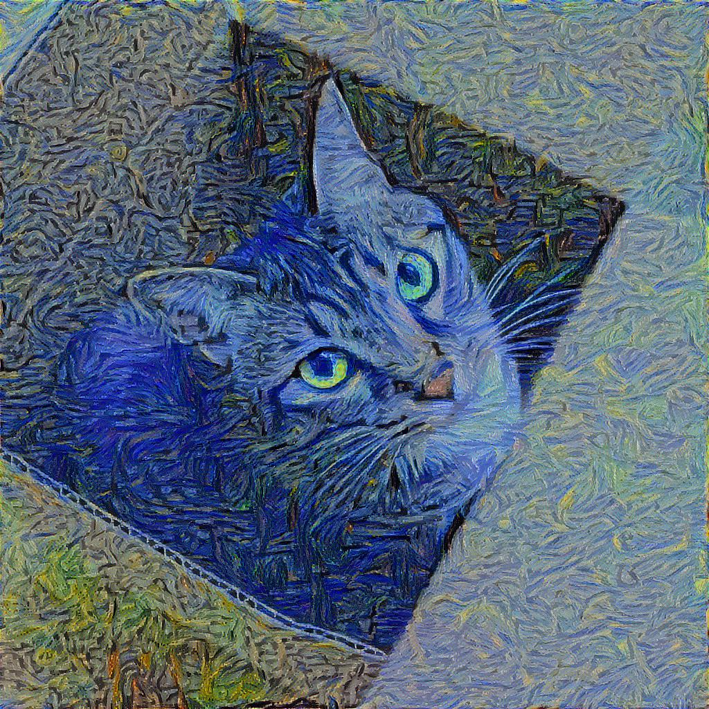

# Style Transfer with TensorFlow

This repository is a collection of various style-transfer models.

## Getting Started

### Prerequisites
* TensorFlow 1.10
  * vgg_16 pre-trained models
* Python 3.6
* Python libraries:
  * numpy, matplotlib, PIL
* Jupyter notebook
* OS X and Linux (Not validated on Windows)

## Models

### A Neural Algorithm of Artistic Style
* [A Neural Algorithm of Artistic Style](https://arxiv.org/abs/1508.06576)
  * L. Gatys, A. Ecker, M Bethge
* The first paper about the neural style transfer 
* `ipynb code` [model01/01_style_transfer.ipynb](https://nbviewer.jupyter.org/github/ilguyi/style-transfer.tensorflow/blob/master/model01/01_style_transfer.ipynb)

#### Results
##### My cat

## Author
* *Il Gu Yi*
